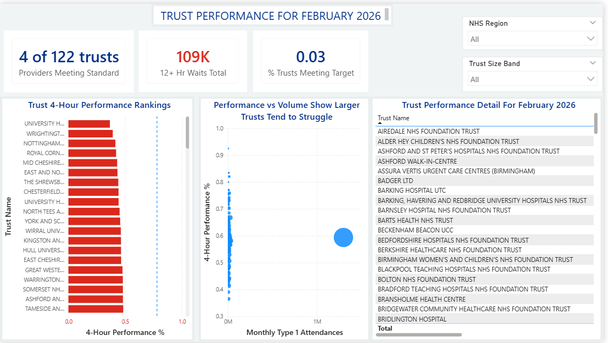
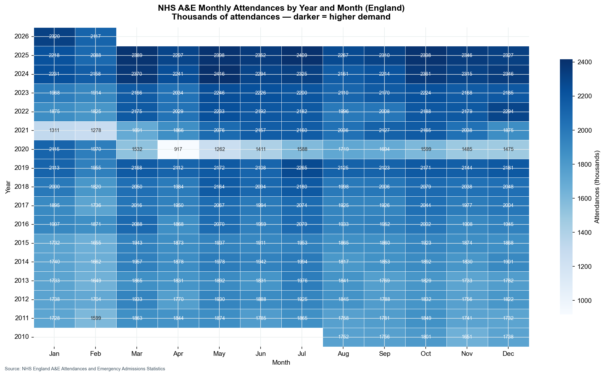

# NHS A&E Performance Dashboard

An end-to-end data analytics portfolio project analysing NHS England A&E waiting time performance using SQL Server, Python, Excel, and Power BI.

---

## Overview

The NHS 4-hour A&E target requires that 95% of patients are seen, treated, and either admitted or discharged within 4 hours of arrival. This standard has not been consistently met since 2013, and was formally reset to 78% in 2023. Despite this, England continues to struggle — as of February 2026 national performance remains below even the revised standard, with wide variation between trusts.

This project builds a complete analytical pipeline around the official NHS England monthly statistics:

- **SQL Server** — structured data storage, complex queries, window functions, CTEs
- **Python** — automated data cleaning, SQL-connected visualisations, publication-quality charts
- **Excel** — stakeholder-ready workbook with conditional formatting and embedded charts
- **Power BI** — interactive dashboard with DAX measures, time intelligence, and regional filtering

The dataset covers **187 months of national data** (Aug 2010 – Feb 2026) and **198 NHS organisations** at provider level (February 2026).

---

## Data Source

**NHS England — A&E Attendances and Emergency Admissions Statistics**
Published monthly by NHS England's Statistical Work Areas.

- Monthly A&E Time Series (national aggregate, Aug 2010 – present)
- Monthly A&E by Provider (trust-level snapshot, most recent month)

---

## Key Findings

- **National 4-hour performance** peaked above 95% in 2013 and has declined since; as of February 2026 it sits below the revised 78% operational standard
- **Provider variation is extreme** — the best-performing trusts exceed 95% while the worst fall below 60%, suggesting operational factors beyond system-wide demand
- **Winter seasonality is structural** — December and January consistently show the highest attendance volumes across every year in the dataset; January average attendances are approximately 15% higher than the summer trough
- **Larger trusts perform worse** on average than smaller ones, likely reflecting their role as major acute centres receiving the most complex cases
- **Emergency admission rates vary by region** — there is meaningful regional variation in the proportion of Type 1 attendees who are subsequently admitted, with implications for bed capacity planning

---

## Methodology

### 1. Data Acquisition
Two files downloaded from NHS England: a 15-year national time series (`.xls` binary format) and a provider-level monthly CSV. Both saved to `data/raw/`.

### 2. Data Cleaning (Python — `scripts/clean_data.py`)
- XLS multi-row headers skipped using `header=13`; data parsed with the `xlrd` engine
- Column names standardised to `snake_case` for SQL compatibility
- Dashes (NHS convention for "not applicable") converted to `pd.NA`
- Numeric columns cast to nullable `Int64` to preserve integer precision with missing values
- 4-hour performance percentage derived: `(within_4hrs / total) × 100`
- Four cleaned CSVs saved to `data/processed/`

### 3. SQL Server Loading & Analysis (`scripts/load_to_sqlserver.py`, `sql/`)
- Connected to local SQL Server Express via Windows Authentication (pyodbc)
- Three tables created in `NHS_AE_Analysis` database with appropriate data types
- Six analytical queries written using: dynamic date filtering, NULLIF for safe division, window functions (LAG, DENSE_RANK, PARTITION BY), CTEs, and CASE statements

### 4. Python Visualisations (`scripts/visualisations.py`)
- Five charts produced using matplotlib and seaborn, styled to the NHS colour palette
- Data pulled directly from SQL Server via `pd.read_sql()`
- Charts saved to `output/charts/` at 150 DPI

### 5. Excel Workbook (`scripts/build_excel.py`)
- Four-sheet workbook: Summary dashboard, Monthly Trends, Trust Rankings (conditionally formatted), Data
- Built programmatically with openpyxl; NHS-standard traffic-light formatting applied

### 6. Power BI Preparation
- Two Power BI-ready CSVs exported: `powerbi_ready_timeseries.csv` and `powerbi_ready_providers.csv`
- Full build guide in `output/powerbi_guide.md` including DAX measures with explanations

---

## Charts

| Chart | File |
|---|---|
| Monthly A&E attendances trend (Aug 2010–Feb 2026) | `output/charts/line_monthly_attendances.png` |
| 4-hour target performance over time | `output/charts/line_4hr_performance.png` |
| Top 10 and bottom 10 trusts by performance (Feb 2026) | `output/charts/bar_top_bottom_trusts.png` |
| Seasonal attendance heatmap (year × month) | `output/charts/heatmap_seasonal.png` |
| Emergency admission rates by region and trust size | `output/charts/bar_admissions_by_region.png` |

---

## Folder Structure

```
nhs-ae-dashboard/
├── data/
│   ├── raw/                    # Original files as downloaded from NHS England
│   └── processed/              # Cleaned, analysis-ready CSVs
├── sql/                        # Six SQL Server analytical queries
├── scripts/
│   ├── clean_data.py           # Data cleaning pipeline
│   ├── load_to_sqlserver.py    # SQL Server connection and table loading
│   ├── visualisations.py       # Five matplotlib/seaborn charts
│   └── build_excel.py          # Programmatic Excel workbook builder
├── output/
│   ├── charts/                 # PNG charts (150 DPI)
│   ├── excel/                  # nhs_ae_analysis.xlsx
│   ├── powerbi_ready_timeseries.csv
│   ├── powerbi_ready_providers.csv
│   └── powerbi_guide.md        # Power BI build instructions with DAX
├── docs/
│   └── interview_guide.md      # Full project walkthrough for interview prep
├── requirements.txt
└── README.md
```

---

## How to Reproduce

### Prerequisites
- Python 3.9+
- SQL Server Express (free) with ODBC Driver 17 for SQL Server
- Windows Authentication enabled on your SQL Server instance

### Steps

```bash
# 1. Install Python dependencies
pip install -r requirements.txt

# 2. Clean the raw data
python scripts/clean_data.py

# 3. Load to SQL Server (creates NHS_AE_Analysis database and tables)
python scripts/load_to_sqlserver.py

# 4. Run SQL queries
# Open sql/*.sql in SQL Server Management Studio or Azure Data Studio

# 5. Generate charts
python scripts/visualisations.py

# 6. Build Excel workbook
python scripts/build_excel.py

# 7. Export Power BI-ready CSVs
python scripts/build_powerbi.py
```

To update with newer data: download the latest files from NHS England into `data/raw/`, replace the filenames in `clean_data.py` and `load_to_sqlserver.py`, and re-run steps 2–7.

---

## Tools Used

| Tool | Version | Purpose |
|---|---|---|
| SQL Server Express | 2019+ | Data storage and analytical queries |
| Python | 3.9+ | Data cleaning, SQL connection, visualisations |
| pandas | 2.x | Data manipulation and cleaning |
| matplotlib | 3.x | Chart production |
| seaborn | 0.x | Statistical visualisations (heatmap) |
| openpyxl | 3.x | Excel workbook generation |
| pyodbc | 4.x | SQL Server ODBC connection |
| Excel | 2016+ | Stakeholder reporting workbook |
| Power BI Desktop | Latest | Interactive dashboard |

---

## Screenshots

### Power BI Dashboard

**Page 1 — National Overview**


**Page 2 — Trust Performance**


**Page 3 — Seasonality & Admissions**


### Python Charts

| Chart | Preview |
|---|---|
| Monthly A&E attendances trend |  |
| 4-hour target performance over time |  |
| Top 10 and bottom 10 trusts by performance |  |
| Seasonal attendance heatmap |  |
| Emergency admission rates by region |  |

---

## Interview Preparation

See `docs/interview_guide.md` for a full walkthrough of every technical decision in this project — designed to help you explain and defend each choice in an NHS analyst interview.
